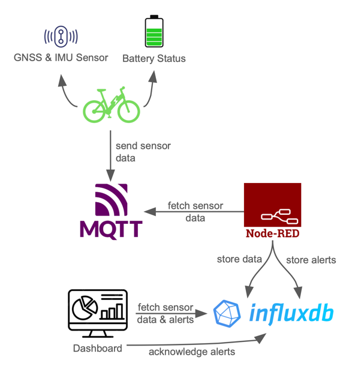
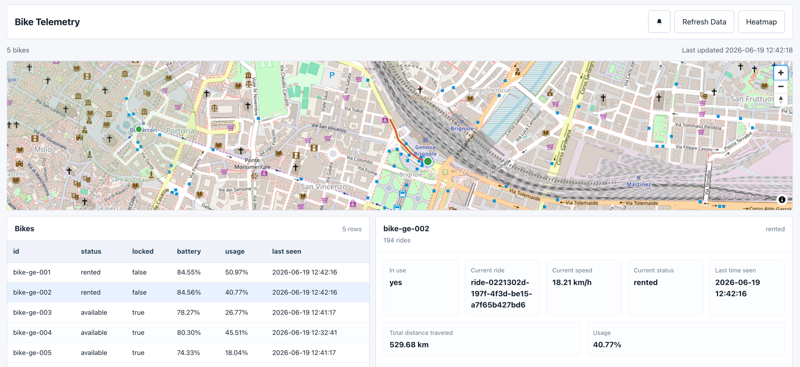
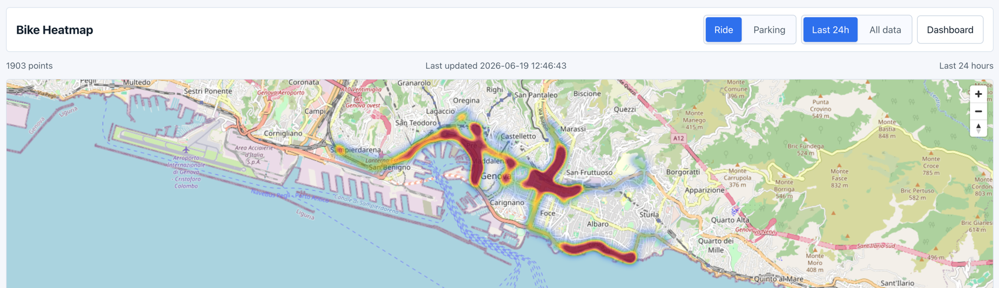
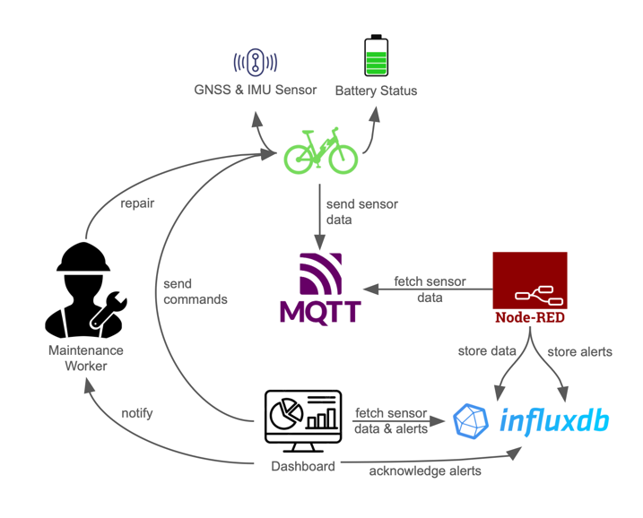

# IoT Project UNIGE 2026 – Smarter Bicycle Mobility in Genoa

This is a design for a bike sharing mobility platform for the municipality of Genoa.
The slideshow can be found [here](presentation.pdf).

Docker is required to run the project.
The following command starts all the services and the simulation:
```shell
docker compose up -d
```
The dashboard will be available at [http://localhost:80](http://localhost:80).
The simulation will continue even if the dashboard is not open.

## Architecture



The system consists of the following components

 - Bikes are equipped with sensors, including GPS, orientation, acceleration, the charging status of the battery as well as information about the bike itself e.g. if its locked or currently rented.
 - The bike sends this combined sensor data to the MQTT message broker [Mosquito](https://mosquitto.org).
 - Node-RED fetches the data from the MQTT broker and detects whether certain alerts should be triggered.
 - The alerts and the initial sensor data are then persisted in the time series database [influxdb](https://www.influxdata.com).
 - A dashboard fetches all data from the database to organize and visualize it.
 - Alerts can be acknowledged in the dashboard, which will create a new record in the database.

In the following sections, the components are described in more detail.

### Bike and Simulation

In a real deployment, each bicycle would be equipped with the following sensors:

- **GNSS receiver**  provides real-time position (latitude, longitude) and speed
- **IMU (Inertial Measurement Unit)**  measures acceleration and orientation on 3 axes, used for fall detection
- **Battery monitor**  tracks the state of charge of the e-bike battery

The onboard device (e.g. a Raspberry Pi, ESP32, or dedicated MCU) collects data from these sensors and publishes it to the MQTT broker over a mobile network (4G/LTE or NB-IoT for low power). Each bike publishes to the topic `bike/{bike_id}/telemetry` every 2 seconds while active.

Since physical bikes are not available for this prototype, a software simulator replaces the edge devices. The simulator is a Node.js application that models 5 bikes riding real routes in Genoa fetched from OSRM. It simulates sensor behavior including:

- GPS movement along real road routes
- IMU readings with Gaussian noise based on speed
- Battery drain proportional to distance traveled
- RSSI-based packet loss and network latency per urban zone

On startup, the simulator seeds 30 days of historical data into InfluxDB before starting the live simulation. Each bike has a different usage profile to simulate realistic fleet diversity.

The simulator supports injectable scenarios for testing and demonstration:

| Scenario      | Description                                                                 |
|---------------|-----------------------------------------------------------------------------|
| `normal`      | Standard simulation    bike rides routes around Genoa normally               |
| `fall`        | At tick 10, bike falls and stays on the ground permanently                  |
| `low_battery` | Battery forced to 15% at tick 1 triggers low battery alert immediately    |

### Data Processing

Data processing is handled by Node-RED, which subscribes to the MQTT broker and runs 5 independent flows:

- **Flow A    Ingest & Store**    receives all telemetry and writes it to InfluxDB
- **Flow B    Fall Detection**    detects falls based on IMU values when the bike is rented
- **Flow C    Parking Violation**    detects bikes parked outside authorized zones
- **Flow D    Battery Alerts**    monitors battery level with 3 severity tiers (low, medium, high)
- **Flow E    Connectivity Monitoring**    detects bikes that have not sent data for more than 60 seconds

All alerts are written to InfluxDB and displayed in the dashboard in real time.

A more technical description can be found in [INTEGRATION.md](./INTEGRATION.md#node-red-flows).

### Data Visualization and Controls



The data is visualized in a dashboard in order for operators to quickly get an overview of the bike fleet.
It allows analysis on different levels:

- Map
  - Shows the location of all bikes
  - Show the route of a selected ride
  - Highlights bikes with unhandled alerts
- Bike list
  - Lists further information of all bikes in the fleet like rental status, battery charge and usage
- Bike details 
  - Further status information regarding a single bike including total traveled km
  - List of all bike rides
  - List of all errors of this bike
  - Chart showing battery charge over the last 24 hours
  - Chart showing bike speed over the last 24 hours
- Alerts
  - All unhandled alerts are shown to the user
  - Toasts notify user about new alerts in real time
  - Alerts can be acknowledged in bike details view
- Heatmap
  - Shows popular routes in the last 24 hours or all time
  - Shows popular parking locations in the last 24 hours or all time

As the data is stored in a raw format in the influxdb, further dashboards could be built using a tool like Grafana.
Further data could be added and visualized, including the quality of GNSS signal, sensor malfunctions, etc.
It should be carefully decided which data is relevant to see at the first glance and which data might only be necessary in specific circumstances to not overload the screen.

Additional to the data visualization, the dashboard could also become a control panel for operators.
This could include locking or unlocking a bike from the application, changing the restriced/allowed parking zones and automatically notifying an employee about necessary bike maintenance.
This architecture is visualized in the image below.



A more technical description can be found in [INTEGRATION.md](./INTEGRATION.md#dashboard)
